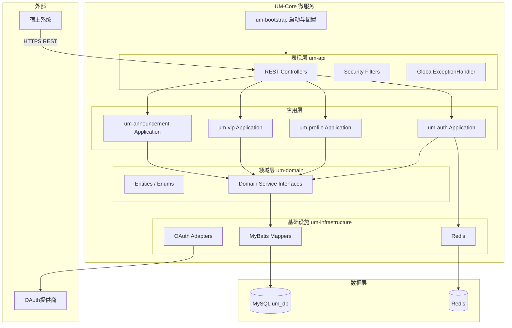
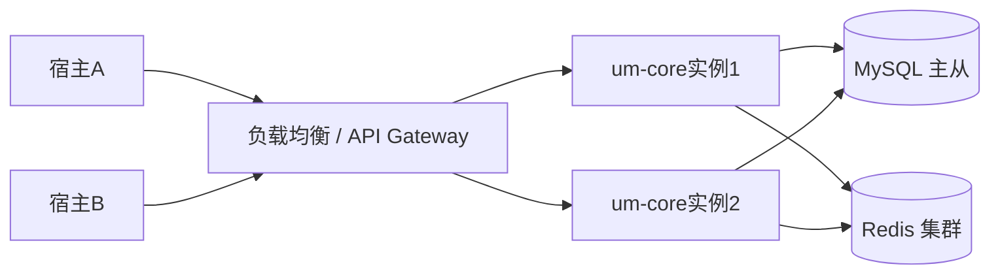

# UM-Core 系统架构

## 1. 产品定位

UM-Core 是**通用用户管理微服务**，职责边界如下：

| 包含 | 不包含 |
|------|--------|
| 账号注册、登录、登出、注销 | 订单、支付、商品等业务 |
| 用户资料与扩展字段 | 宿主业务权限模型（RBAC 由宿主实现） |
| VIP 等级与订阅状态 | 具体权益发放逻辑（宿主根据 VIP 状态自行实现） |
| 系统公告发布与查询 | 站内信、推送通道实现 |

宿主系统通过 **REST API** 调用 UM-Core，使用返回的 `user_id` 关联本地业务数据。

## 2. 技术栈

| 类别 | 选型 | 版本建议 |
|------|------|----------|
| 语言 | Java | 21 |
| 构建 | Maven | 3.9.16 |
| 框架 | Spring Boot | 3.2.x |
| 安全 | Spring Security | 6.x |
| ORM | MyBatis-Plus | 3.5.x |
| 数据库 | MySQL | 8.0+ |
| 缓存 | Redis | 7.x+ |
| 迁移 | Flyway | 9.x+ |
| API 文档 | springdoc-openapi | 3.x |
| 测试 | JUnit 5、Mockito、Testcontainers | — |

详见 [ADR-001](./adr/ADR-001-standalone-microservice.md)。

## 3. 逻辑架构

## 4. 核心业务子系统

### 4.1 账号认证（Account & Auth）

- **注册**：用户名/密码、手机/验证码、邮箱、第三方 OAuth。
- **登录**：JWT Access + Refresh；多端 `device_id`；踢人下线。
- **登出**：Token 吊销、Refresh 删除。
- **注销**：软删除 + 敏感字段匿名化，禁止物理删除用户主表。
- **风控**：密码错误锁定、异地登录检测（可配置）。

### 4.2 用户信息（User Profile）

- 注册后资料初始化（昵称、头像、性别等）。
- 固定列 + `extension_json` 扩展字段。
- 修改操作使用乐观锁 `version`。

### 4.3 VIP 会员（VIP & Subscription）

- 多级 VIP（青铜/白银/黄金等），含权重与权益 JSON。
- 开通、续费、升级（剩余时间折算）、惰性过期。
- **禁止** Cron 全表扫描降级；查询时惰性判断 + 异步落库。

### 4.4 系统公告（Announcement）

- 草稿 / 已发布 / 下线状态机。
- 受众：全量、指定租户、指定 VIP 等级。
- 对外只读列表与详情；管理端 CRUD（需管理员角色）。

## 5. 部署架构

### 5.1 运行时要求

- 无状态应用实例，会话与 Token 状态存 Redis。
- 健康检查：`GET /actuator/health`（仅内网或运维网络暴露）。
- 配置通过环境变量 `UM_*` 注入，禁止镜像内硬编码密钥。

### 5.2 网络与安全

- 对外 HTTPS；服务间调用携带 `X-Api-Key`（可选）与 `Authorization: Bearer`。
- MySQL、Redis 仅内网可达。
- 生产环境关闭 Swagger UI 或限制 IP 白名单。

## 6. 数据架构原则

- 表前缀：`um_`。
- 全局用户标识：`user_id`（BIGINT 雪花或 CHAR(36) UUID，项目内统一一种）。
- 多租户（可选）：`tenant_id` 列 + API Header `X-Tenant-Id`。
- 审计字段：`created_at`, `updated_at`, `created_by`, `updated_by`。
- 软删除：`deleted_at`（用户主表）；逻辑删除字段配合 MyBatis-Plus `@TableLogic`。

## 7. API 架构原则

- 统一前缀：`/api/v1/um/`
- 统一响应体：`ApiResponse<T>`
- 错误码分段：见 [conventions/04-rest-api.md](./conventions/04-rest-api.md)
- 写操作幂等：VIP 开通/续费支持 `Idempotency-Key`

## 8. 非功能性要求

| 维度 | 目标 |
|------|------|
| 可用性 | 单实例故障不影响整体（多实例 + LB） |
| 安全 | OWASP 基线；密码 BCrypt；Token 短期有效 |
| 可观测 | traceId 全链路；结构化日志 |
| 可扩展 | 资料 JSON 扩展；VIP 权益 JSON；公告受众可配置 |

## 9. 演进路线（参考）

1. **Phase 1**：多模块骨架 + 认证 + 资料 CRUD。
2. **Phase 2**：VIP 开通/续费/升级 + 惰性过期。
3. **Phase 3**：公告模块 + 管理端 API。
4. **Phase 4**：OAuth 提供商、异地登录告警、多租户强化。

## 10. 相关文档

- [MODULE_STRUCTURE.md](./MODULE_STRUCTURE.md)
- [EMBEDDING_AND_INTEGRATION.md](./EMBEDDING_AND_INTEGRATION.md)
- [AI_PROGRAMMING_CONVENTIONS.md](./AI_PROGRAMMING_CONVENTIONS.md)
