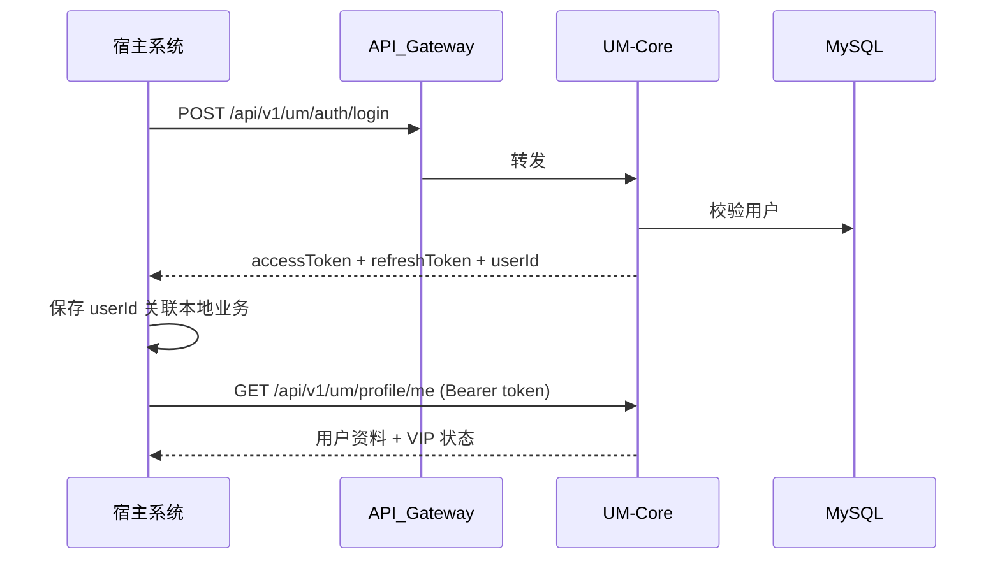

# 宿主系统集成指南

UM-Core 以**独立微服务**形式部署，宿主系统通过 HTTP 集成。本文描述契约、认证、租户与最佳实践。

## 1. 集成模式



### 1.1 原则

- 宿主**不**直连 UM 数据库。
- 宿主本地表保存 `um_user_id` 外键关联。
- Token 由 UM 签发与校验；宿主网关可透传或自行校验 JWT（需共享公钥，见 3.2）。

## 2. 基础连接配置

| 配置项 | 说明 | 示例 |
|--------|------|------|
| Base URL | UM 服务地址 | `https://um.example.com` |
| API 前缀 | 固定 | `/api/v1/um` |
| 超时 | 建议 | 连接 3s，读取 10s |
| 重试 | 仅幂等 GET | 最多 2 次，指数退避 |

### 2.1 环境变量（宿主侧）

```properties
um.base-url=https://um.example.com
um.api-key=${UM_API_KEY}          # 服务间调用
um.connect-timeout=3000
um.read-timeout=10000
```

## 3. 认证方式

### 3.1 用户态：Bearer JWT（推荐）

终端用户经宿主登录页调用 UM 登录接口后，宿主获得：

```json
{
  "accessToken": "eyJ...",
  "refreshToken": "uuid-or-jwt",
  "expiresIn": 7200,
  "userId": 1234567890123456789,
  "tokenType": "Bearer"
}
```

后续请求 Header：

```http
Authorization: Bearer <accessToken>
```

Access Token 过期后，宿主调用：

```http
POST /api/v1/um/auth/refresh
Content-Type: application/json

{ "refreshToken": "..." }
```

### 3.2 服务态：API Key（宿主后端 → UM）

宿主后端批量查询、同步用户时，使用：

```http
X-Api-Key: <host-assigned-key>
X-Tenant-Id: <tenantId>    # 多租户时必填
```

- API Key 在 UM 管理配置中注册，绑定 `host_app_id`。
- **禁止**将 API Key 下发到浏览器或移动端。

### 3.3 JWT 公钥校验（可选）

若宿主网关需本地校验 JWT：

1. UM 暴露 `GET /api/v1/um/auth/jwks` 或配置静态公钥。
2. 宿主只信 UM 签发的 `iss=um-core`。
3. 权限仍由宿主 RBAC 实现；JWT 仅证明用户身份。

## 4. 多租户

启用多租户时：

| Header | 必填 | 说明 |
|--------|------|------|
| `X-Tenant-Id` | 是 | 租户标识，与表 `tenant_id` 对应 |

- 注册、登录、资料、VIP、公告查询均按租户隔离。
- 宿主须在业务入口解析租户并传入 UM。

## 5. 核心 API 清单（宿主常用）

| 场景 | 方法 | 路径 |
|------|------|------|
| 注册 | POST | `/auth/register` |
| 登录 | POST | `/auth/login` |
| 刷新 Token | POST | `/auth/refresh` |
| 登出 | POST | `/auth/logout` |
| 注销账号 | POST | `/auth/deactivate` |
| 当前用户资料 | GET | `/profile/me` |
| 更新资料 | PUT | `/profile/me` |
| 查询 VIP 状态 | GET | `/vip/me` |
| 公告列表 | GET | `/announcements` |
| 公告详情 | GET | `/announcements/{id}` |

完整契约见部署环境的 Swagger：`/swagger-ui.html`（生产建议关闭或限 IP）。

## 6. 统一响应格式

```json
{
  "code": 0,
  "message": "success",
  "data": { },
  "traceId": "a1b2c3d4",
  "timestamp": "2026-05-17T10:00:00Z"
}
```

| code | 含义 |
|------|------|
| 0 | 成功 |
| 非 0 | 业务或系统错误，见 `message` 与错误码文档 |

宿主应记录 `traceId` 便于联合排查。

## 7. 错误处理与重试

| HTTP 状态 | 宿主建议 |
|-----------|----------|
| 400 | 修正请求参数，勿重试 |
| 401 | 引导重新登录或刷新 Token |
| 403 | 权限不足，记录审计 |
| 429 | 限流，退避重试 |
| 500/502/503 | 可重试 GET；写操作依赖幂等键 |

## 8. 幂等性

VIP 开通、续费等写操作，宿主应传：

```http
Idempotency-Key: <uuid>
```

相同 Key 在 24h 内返回相同结果，防止重复扣费。

## 9. 用户注销与数据保留

- 用户调用注销后，UM 执行软删除 + 匿名化。
- 宿主**保留**历史订单等关联数据，仅将展示名改为「已注销用户」。
- 宿主不得再使用该 `user_id` 发起登录；可定时任务清理本地 PII 缓存。

## 10. VIP 状态消费

宿主**不应**自行根据本地缓存判断 VIP 是否有效；应：

1. 调用 `GET /api/v1/um/vip/me` 获取当前有效状态；或
2. 登录响应中附带 VIP 快照（注意 TTL）。

UM 内部使用惰性过期，宿主看到的过期用户即按普通用户处理。

## 11. Webhook（预留）

后续可支持事件推送（用户注销、VIP 变更）：

```http
POST <host-webhook-url>
X-UM-Signature: HMAC-SHA256(...)
```

当前版本以**宿主轮询或同步 API** 为主；实现 Webhook 时需新增 ADR。

## 12. 安全 checklist（宿主）

- [ ] 全链路 HTTPS
- [ ] API Key 仅在后端使用
- [ ] 不记录 accessToken 到日志
- [ ] `user_id` 使用 BIGINT/String 一致类型存储
- [ ] 注销用户后撤销本地 Session

## 13. 相关文档

- [ARCHITECTURE.md](./ARCHITECTURE.md)
- [conventions/04-rest-api.md](./conventions/04-rest-api.md)
- [conventions/05-security-and-auth.md](./conventions/05-security-and-auth.md)
