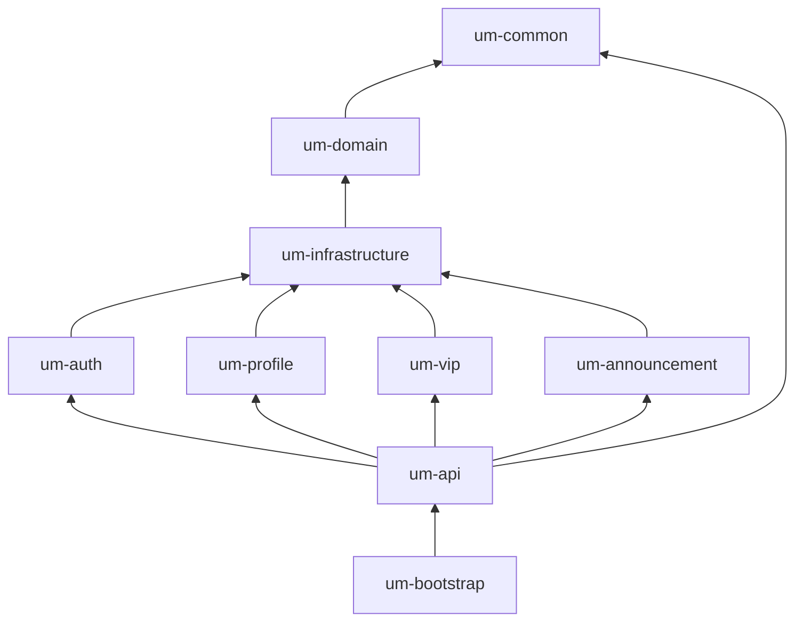

# UM-Core 模块结构

## 1. Maven 多模块总览

根工程 `um-core`（`packaging=pom`），`groupId` 统一为 `com.um.core`。

```
um-core/                          # parent POM, dependencyManagement
├── um-common/                    # 通用工具、常量、统一响应、异常
├── um-domain/                    # 领域实体、枚举、领域服务接口
├── um-infrastructure/            # MyBatis-Plus、Redis、OAuth 适配
├── um-auth/                      # 账号认证
├── um-profile/                   # 用户资料
├── um-vip/                       # VIP 会员
├── um-announcement/              # 系统公告（必填）
├── um-api/                       # REST 对外门面（必填）
└── um-bootstrap/                 # Spring Boot 启动、Flyway、配置
```

每个子模块标准目录：

```
um-{name}/
├── pom.xml
├── src/main/java/
├── src/main/resources/           # 仅 infrastructure/bootstrap 需要较多资源
└── src/test/java/
```

## 2. 模块依赖图



### 2.1 依赖规则（必须遵守）

| 规则 | 说明 |
|------|------|
| 单向依赖 | 禁止循环依赖；`mvn dependency:analyze` 无警告 |
| API 唯一入口 | **仅** `um-api` 含 `@RestController` |
| 领域纯净 | `um-domain` 不依赖 Spring、MyBatis |
| 基础设施下沉 | 所有 Mapper、PO、Redis 实现在 `um-infrastructure` |
| 业务模块不互依 | `um-auth` 与 `um-profile` 等通过 `um-api` 编排或领域事件协作 |

### 2.2 禁止的依赖

| 从 | 到 | 原因 |
|----|-----|------|
| um-domain | um-infrastructure | 领域不应依赖基础设施 |
| um-auth | um-api | 业务不应依赖表现层 |
| um-common | 任意业务模块 | common 为最底层 |
| 任意模块 | um-bootstrap | 启动模块仅作聚合 |

## 3. 各模块职责

### um-common

- `ApiResponse`、`PageResult`、`BusinessException`
- 错误码常量 `ErrorCodes`
- 工具类：`JsonUtils`、`IdGenerator`
- 自定义校验注解

**禁止**：业务逻辑、数据库访问、Spring Web 依赖（除 validation 可选）。

### um-domain

- 领域实体：`User`、`UserProfile`、`UserVip`、`Announcement`
- 枚举：`VipLevelCode`、`UserStatus`、`AnnouncementStatus`
- 领域服务接口：`VipExpireService`、`AuthDomainService`
- 值对象：`VipStatus`、`PhoneNumber`

**禁止**：MyBatis 注解、HTTP、Redis API。

### um-infrastructure

- MyBatis `*Mapper`、`*PO`、XML
- `*RepositoryImpl` 实现领域仓储接口
- Redis、OAuth HTTP 客户端
- Flyway 不负责（脚本在 bootstrap，实现类在此）

### um-auth

- 应用服务：`RegisterService`、`LoginService`、`LogoutService`、`DeactivateService`
- 命令/查询对象（非 REST DTO）
- 登录风控、Token 签发协作

### um-profile

- 资料初始化、更新
- `extension_json` 合并策略

### um-vip

- 开通、续费、升级
- **惰性过期** `VipStatusResolver`
- 升级剩余时间折算算法

### um-announcement

- 公告 CRUD、发布、下线
- 受众筛选查询

### um-api

- `@RestController`、Request/Response DTO
- `GlobalExceptionHandler`
- Spring Security 过滤器配置入口
- OpenAPI `@Tag`、`@Operation`

### um-bootstrap

- `@SpringBootApplication`
- `application.yml` / `application-{profile}.yml`
- `db/migration/*.sql`（Flyway）
- Actuator 配置

## 4. 包结构约定

根包：`com.um.core`

```
com.um.core.{module}.{layer}.{feature}
```

| layer | 典型类 |
|-------|--------|
| api | `AuthController`（仅 um-api） |
| application | `LoginApplicationService` |
| domain | `User`, `VipDomainService` |
| infrastructure | `UserMapper`, `UserRepositoryImpl` |

示例：

```
com.um.core.api.controller.auth.AuthController
com.um.core.auth.application.LoginApplicationService
com.um.core.domain.model.user.User
com.um.core.infrastructure.persistence.mapper.UserMapper
```

## 5. 资源文件位置

| 资源 | 模块 |
|------|------|
| `mapper/**/*.xml` | um-infrastructure |
| `db/migration/V*.sql` | um-bootstrap |
| `application*.yml` | um-bootstrap |
| `messages*.properties` | um-bootstrap 或 um-common |
| `logback-spring.xml` | um-bootstrap |

## 6. 新增模块流程

1. 在根 `pom.xml` `<modules>` 注册。
2. 父 POM `dependencyManagement` 声明版本。
3. 明确依赖：通常 `→ um-infrastructure` 或 `→ um-domain`。
4. 更新本文档与 `AI_PROGRAMMING_CONVENTIONS.md`。
5. **新增父 POM 依赖前须征得维护者同意**（仓库边界）。

## 7. 与计划中的目录映射

用户要求的顶层目录语义：

| 要求 | Maven 对应 |
|------|------------|
| `src/` | 各模块 `src/main/java` |
| `test/` | 各模块 `src/test/java` |
| `docs/` | 仓库根 `docs/`（本文档所在） |

## 8. 相关文档

- [ARCHITECTURE.md](./ARCHITECTURE.md)
- [conventions/01-project-and-maven.md](./conventions/01-project-and-maven.md)
- [conventions/03-package-and-naming.md](./conventions/03-package-and-naming.md)
