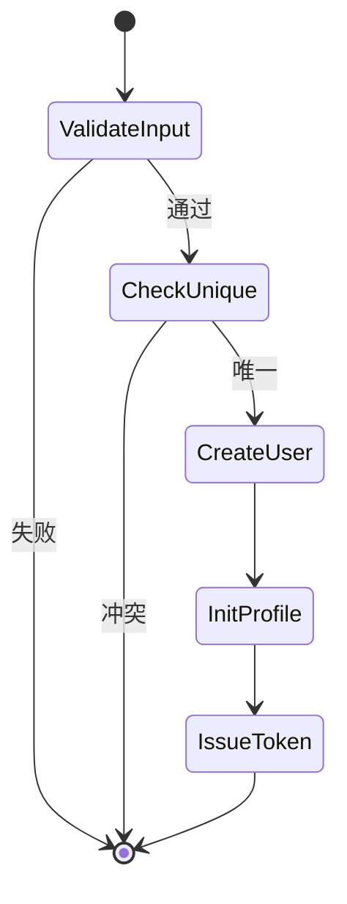
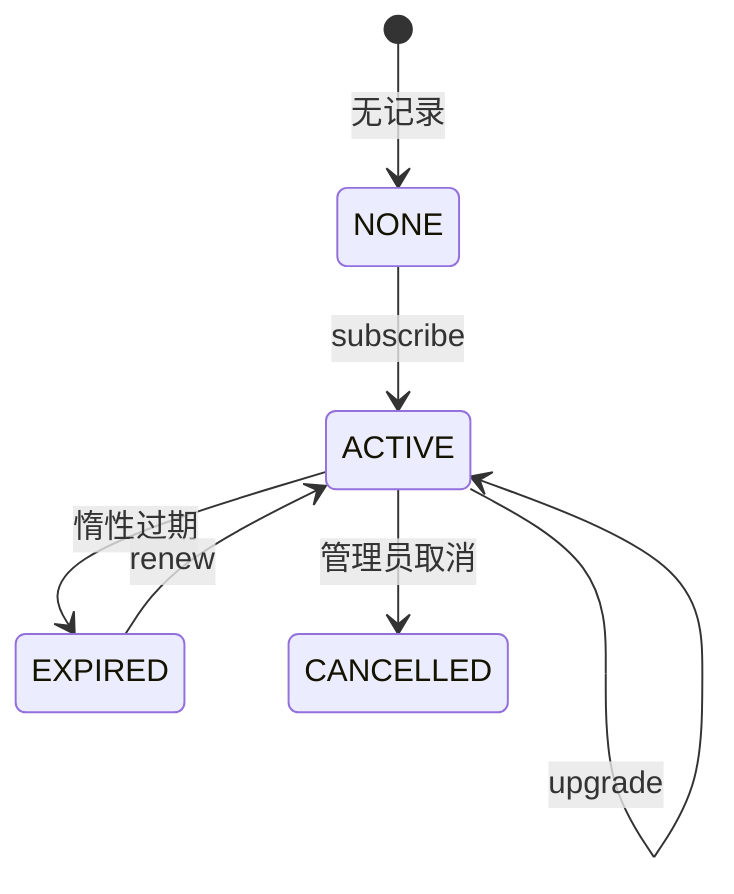

# 07 - 领域规约：认证 / 资料 / VIP

## 1. 账号认证

### 1.1 注册流程



**必须**：

- 同一事务：创建 `um_user` + 初始化 `um_user_profile`。
- 密码 BCrypt 后入库。
- 返回 userId + Token（若注册后自动登录）。

### 1.2 登录流程

1. 检查账号锁定（Redis）。
2. 校验密码；失败累加计数。
3. 成功清除失败计数。
4. 签发 Access + Refresh，写 Redis。
5. 可选：记录登录 IP、设备；触发 VIP 惰性过期检查。

### 1.3 登出

- 吊销当前 device refresh + Access blacklist。

### 1.4 注销

- 见分卷 05；**软删除 + 匿名化**。
- 保留 `user_id` 供宿主关联历史数据。

## 2. 用户资料

### 2.1 初始化

注册成功后创建 profile 默认行：

| 字段 | 默认 |
|------|------|
| nickname | `用户` + id 后 4 位 |
| avatar_url | 系统默认 URL |
| gender | 0 |
| extension_json | `{}` |

### 2.2 更新

```java
@Transactional
public void updateProfile(UpdateProfileCommand cmd) {
    UserProfile profile = profileRepository.findByUserId(cmd.userId())
        .orElseThrow(() -> new BusinessException(ErrorCodes.PROFILE_NOT_FOUND));
    if (!profile.getVersion().equals(cmd.expectedVersion())) {
        throw new BusinessException(ErrorCodes.PROFILE_VERSION_CONFLICT);
    }
    profile.apply(cmd);
    profileRepository.save(profile); // version+1
}
```

### 2.3 extension_json 合并

- PATCH 语义：仅更新传入 key，不覆盖整个 JSON（除非 PUT 全量）。
- 禁止宿主定义 key 覆盖系统保留键：`_sys`, `_internal`。

## 3. VIP 会员

### 3.1 等级

| code | weight | 说明 |
|------|--------|------|
| BRONZE | 10 | 青铜 |
| SILVER | 20 | 白银 |
| GOLD | 30 | 黄金 |

权重高的等级权益包含低等级（业务配置在 `benefits_json`）。

### 3.2 状态机



### 3.3 开通 Subscribe

```
expire_at = now + duration
status = ACTIVE
```

幂等：`Idempotency-Key` + 订单号（若有）唯一。

### 3.4 续费 Renew

```
expire_at = max(expire_at, now) + duration
```

已过期用户续费从 `now` 起算。

### 3.5 升级 Upgrade

**折算公式（示例，可配置系数）**：

```
remainingSeconds = max(0, expire_at - now)
remainingValue = remainingSeconds * oldLevel.dailyPrice
newDurationSeconds = remainingValue / newLevel.dailyPrice
expire_at = now + newDurationSeconds + purchasedDuration
level_id = newLevelId
```

- 补差价由宿主支付系统处理；UM 只接收「升级指令」与时长。
- 必须在 Application 层事务内完成。

### 3.6 惰性过期（核心）

```java
public VipStatus resolveVipStatus(Long userId) {
    UserVipPO vip = userVipMapper.selectByUserId(userId);
    if (vip == null) {
        return VipStatus.none();
    }
    Instant now = Instant.now();
    if (vip.getExpireAt().isBefore(now)) {
        if (VipStatusEnum.ACTIVE.name().equals(vip.getStatus())) {
            vipExpireService.markExpiredAsync(userId);
        }
        return VipStatus.none();
    }
    return VipStatus.from(vip);
}
```

```java
@Async("umTaskExecutor")
public void markExpiredAsync(Long userId) {
    userVipMapper.updateStatus(userId, VipStatusEnum.EXPIRED);
}
```

**禁止**：

```java
// 反模式：定时任务扫表
@Scheduled(cron = "0 0 * * * ?")
void downgradeAllExpired() { ... }
```

### 3.7 触发异步降级的时机

- 查询 VIP 状态且发现过期
- 用户登录成功
- VIP 写操作前校验

## 4. 跨域协作

- 登录响应可嵌入 `VipStatus` 快照（调用 `resolveVipStatus`）。
- 资料模块不直接改 VIP 表；通过 Application 编排。

## 5. 检查清单

- [ ] 注册事务含 profile 初始化
- [ ] 注销非物理删除
- [ ] VIP 读路径惰性判断
- [ ] 无 Cron 扫表 VIP
- [ ] 资料更新有乐观锁
