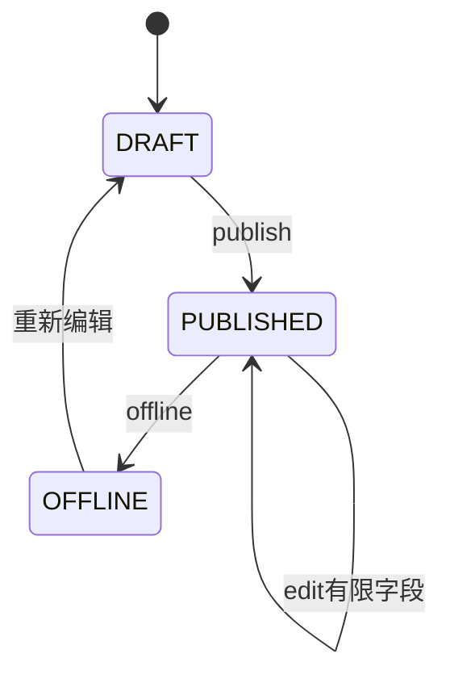

# 08 - 公告模块规约

## 1. 职责

- 系统公告的创建、编辑、发布、下线、查询。
- 对外（宿主/终端）提供只读列表与详情。
- 管理端 API 需管理员角色（`ROLE_UM_ADMIN` 或 API Key 管理 scope）。

## 2. 数据模型 um_announcement

| 列 | 类型 | 说明 |
|----|------|------|
| id | BIGINT PK | |
| tenant_id | BIGINT NULL | NULL 表示平台级 |
| title | VARCHAR(200) | 标题 |
| content | TEXT | 正文（Markdown 或 HTML，需 XSS 过滤） |
| status | VARCHAR(32) | DRAFT/PUBLISHED/OFFLINE |
| target_type | VARCHAR(32) | ALL/TENANT/VIP_LEVEL |
| target_value | VARCHAR(256) | JSON：租户 ID 列表或 VIP code 列表 |
| publish_at | DATETIME(3) | 计划发布时间 |
| offline_at | DATETIME(3) NULL | 下线时间 |
| priority | INT | 越大越靠前 |
| created_at / updated_at | | 审计 |

索引：`idx_um_ann_status_publish (status, publish_at)`。

## 3. 状态机

| 状态 | 对外可见 |
|------|----------|
| DRAFT | 否 |
| PUBLISHED | 是（且 publish_at <= now） |
| OFFLINE | 否 |

## 4. API

| 方法 | 路径 | 说明 |
|------|------|------|
| GET | `/api/v1/um/announcements` | 分页列表（仅 PUBLISHED） |
| GET | `/api/v1/um/announcements/{id}` | 详情 |
| POST | `/api/v1/um/admin/announcements` | 创建（管理） |
| PUT | `/api/v1/um/admin/announcements/{id}` | 更新 |
| POST | `/api/v1/um/admin/announcements/{id}/publish` | 发布 |
| POST | `/api/v1/um/admin/announcements/{id}/offline` | 下线 |

## 5. 受众筛选 target_type

| 类型 | target_value 示例 | 查询逻辑 |
|------|-------------------|----------|
| ALL | null | 所有用户可见 |
| TENANT | `["1001","1002"]` | 当前 tenant_id 在列表中 |
| VIP_LEVEL | `["GOLD","SILVER"]` | 用户 resolveVipStatus 等级 code 匹配 |

列表查询 SQL 需联表或应用层过滤；优先在 SQL 中过滤 `target_type=ALL OR ...`。

## 6. 安全

- `content` 入库前 HTML 消毒（OWASP Java HTML Sanitizer）。
- 管理端接口必须认证 + 授权。
- 公开列表不返回 `created_by` 等内部字段。

## 7. 模块边界

- 业务逻辑：`um-announcement` ApplicationService。
- Controller：**仅** `um-api` 的 `AnnouncementController` / `AdminAnnouncementController`。
- Mapper：`um-infrastructure`。

## 8. 错误码

| code | 说明 |
|------|------|
| 50001 | 公告不存在 |
| 50002 | 状态不允许该操作 |
| 50003 | 发布时间无效 |

## 9. 检查清单

- [ ] 对外不暴露 DRAFT
- [ ] 发布校验 publish_at
- [ ] 内容 XSS 处理
- [ ] 管理 API 有权限控制
- [ ] 符合 um-announcement 模块边界
