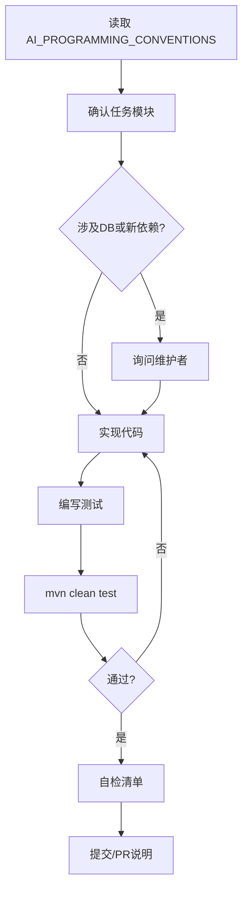

# 12 - Git 与 AI 工作流规约

## 1. 分支策略

| 分支 | 用途 |
|------|------|
| main | 可发布稳定版 |
| develop | 集成开发（若采用 Git Flow） |
| feature/* | 功能开发 |
| fix/* | 缺陷修复 |

AI 默认从 `main` 或当前任务分支拉取 `feature/um-{ticket}-{short-desc}`。

## 2. 提交信息

格式（Conventional Commits 风格）：

```
<type>(<scope>): <subject>

<body optional>
```

| type | 说明 |
|------|------|
| feat | 新功能 |
| fix | 修复 |
| docs | 仅文档 |
| refactor | 重构 |
| test | 测试 |
| chore | 构建/工具 |

scope 示例：`auth`, `vip`, `api`, `docs`。

示例：

```
feat(auth): add phone register with sms verification

- Redis store verification code
- Flyway V2__add_phone_index
```

## 3. AI 工作流程



### 3.1 实现前

1. 阅读 [AI_PROGRAMMING_CONVENTIONS.md](../AI_PROGRAMMING_CONVENTIONS.md) 及任务相关分卷。
2. 确认模块边界（不在 um-api 写 Mapper）。
3. DB/依赖变更先询问。

### 3.2 实现中

- 小步提交逻辑完整单元。
- 不修改 CI 配置。
- 不提交 `.idea` 个人部署配置（如 sshConfigs）除非团队统一要求。

### 3.3 实现后

- 运行 `mvn clean test`。
- 完成主规约 **第 6 节检查清单**。
- PR 描述包含：变更摘要、测试方式、DB 迁移说明（如有）。

## 4. Pull Request 模板（建议）

```markdown
## Summary
-

## Test plan
- [ ] mvn clean test
- [ ] 手动验证 xxx 接口

## DB migration
- [ ] 无
- [ ] V{n}__xxx.sql（已评审）
```

## 5. Code Review 要点

| 检查项 | 说明 |
|--------|------|
| 模块依赖 | 无环、无越层 |
| 安全 | 密码、Token、注销 |
| VIP | 惰性过期、无 Cron 扫表 |
| API | 契约与 OpenAPI 一致 |
| 测试 | 核心路径有覆盖 |

## 6. 禁止提交的文件

- `.env`、`*-secret.yml`
- 真实证书 `*.pem`（开发用假证书需标注 dev-only）
- 编译产物 `target/`
- 违反团队政策的 `.idea/deployment.xml` 等（按 .gitignore 执行）

## 7. 与 Cursor 协作

- 项目规则引用：`docs/AI_PROGRAMMING_CONVENTIONS.md`
- 长任务先输出计划再改代码
- 文档变更使用 `docs:` scope

## 8. 国际化（预留）

消息文件：

```
um-bootstrap/src/main/resources/messages_zh_CN.properties
messages_en.properties
```

键名：`{module}.{key}`，如 `auth.login.failed`。

## 9. 检查清单

- [ ] 提交信息符合 type(scope)
- [ ] mvn clean test 通过
- [ ] 主规约 PR 清单已完成
- [ ] 未改 CI、未提交密钥
