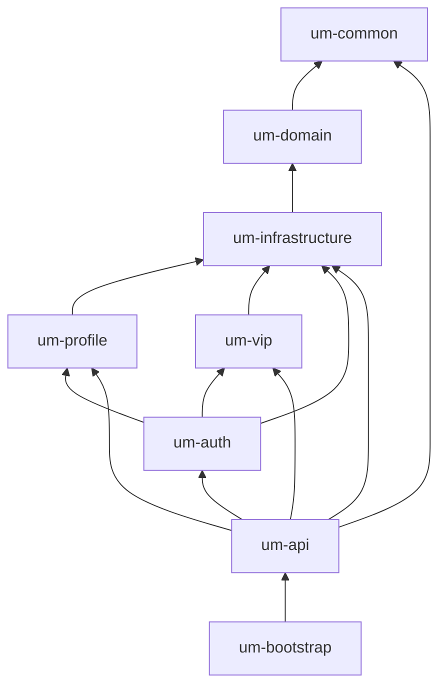
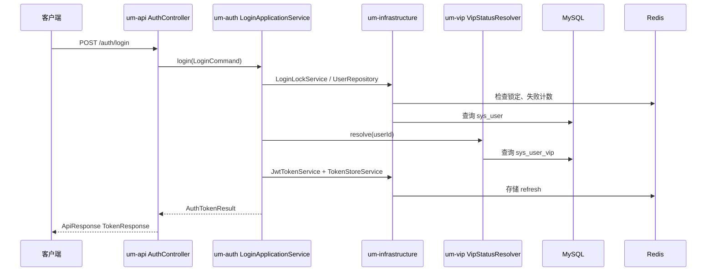

# 01 - 模块关系与分层

## 1. Maven 模块依赖图（当前实现）



> 说明：规约中的 `um-announcement`（公告）模块尚未在本分支实现，后续可独立追加且仅依赖 `um-infrastructure`。

## 2. 分层模型

| 层级 | 所在模块 | 职责 |
|------|----------|------|
| 表现层 | `um-api` | Controller、DTO、Security 过滤器、全局异常 |
| 应用层 | `um-auth` / `um-profile` / `um-vip` | 用例编排、事务边界、领域规则调用 |
| 领域层 | `um-domain` | 枚举、值对象（如 `VipStatus`）、纯领域算法（如 `VipUpgradeCalculator`） |
| 基础设施层 | `um-infrastructure` | MyBatis PO/Mapper、Redis、JWT、仓储封装 |
| 启动与配置 | `um-bootstrap` | `SpringBootApplication`、YAML、Flyway、线程池 |

### 调用方向（必须单向）

```
HTTP 请求
  → um-api Controller
    → um-* ApplicationService
      → um-infrastructure（Mapper / Redis / JwtTokenService）
        → MySQL / Redis
```

**禁止**：Controller 直接调用 Mapper；`um-domain` 依赖 Spring 或 MyBatis。

## 3. 模块协作关系

| 调用方 | 被调用方 | 场景 |
|--------|----------|------|
| um-auth | um-profile | 注册成功后 `initProfile` |
| um-auth | um-vip | 登录成功后 `VipStatusResolver.resolve` 触发惰性过期检查 |
| um-auth | um-infrastructure | 用户持久化、Token、短信码、登录锁定 |
| um-vip | um-infrastructure | VIP 表、流水表、幂等 Redis |
| um-api | um-auth / um-profile / um-vip | 所有 REST 入口 |
| um-api | um-infrastructure | JWT 解析、黑名单校验（Filter） |

## 4. 请求全链路示例（登录）



## 5. 包命名约定

根包：`com.um.core.{module}.{layer}`

示例：

- `com.um.core.api.controller.auth.AuthController`
- `com.um.core.auth.application.LoginApplicationService`
- `com.um.core.infrastructure.persistence.mapper.SysUserMapper`

## 6. 模块文档索引

详见 [README.md](README.md) 中 `modules/` 与 `flows/` 目录。
