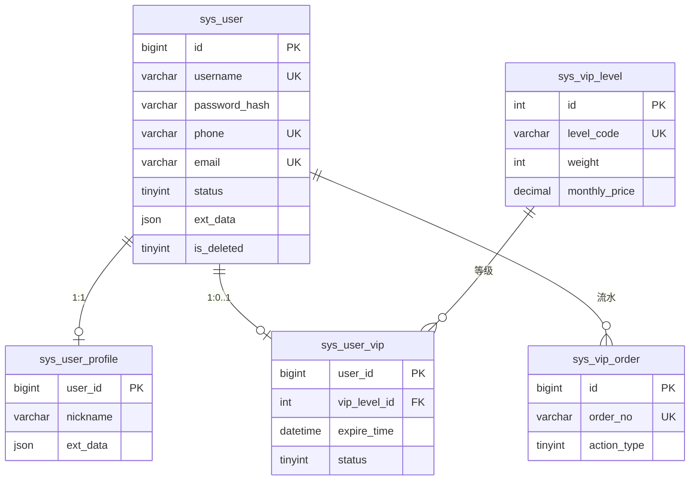

# 02 - 数据模型

## 1. ER 关系概览

## 2. sys_user（账号表）

| 字段 | 说明 |
|------|------|
| id | 主键，自增，宿主系统关联键 |
| username | 登录名，唯一 |
| password_hash | BCrypt 哈希 |
| phone / email | 可选，唯一 |
| status | 0=禁用，1=正常，2=已注销 |
| ext_data | JSON，如 registerIp、lastLoginIp、registerType |
| is_deleted | MyBatis-Plus 逻辑删除 |

**注销策略**：`status=2`，username 改为 `deleted_{id}`，手机/邮箱匿名化，**不物理删除**。

## 3. sys_user_profile（资料表）

| 字段 | 说明 |
|------|------|
| user_id | 主键，与 sys_user.id 一致 |
| nickname / avatar_url / gender / birthday | 基础资料 |
| ext_data | JSON 扩展（个性签名、第三方绑定状态等） |

注册时由 `ProfileApplicationService.initProfile` 自动创建。

## 4. sys_vip_level（等级字典）

预置数据（Flyway V2）：`BRONZE`(10)、`SILVER`(20)、`GOLD`(30)，含 `monthly_price` 供升级折算。

## 5. sys_user_vip（用户 VIP 状态）

| 字段 | 说明 |
|------|------|
| status | 1=生效中，0=已过期（库内状态，展示以惰性求值为准） |
| expire_time | 到期时间，查询时与 `now` 比较 |
| start_time | 本次 VIP 生效起点 |

## 6. sys_vip_order（VIP 流水）

| action_type | 含义 |
|-------------|------|
| 1 | 首开 subscribe |
| 2 | 续费 renew |
| 3 | 升级 upgrade |
| 4 | 后台赠送 gift |

`order_no` 全局唯一，防止支付回调重复处理。

## 7. Flyway 脚本位置

`um-bootstrap/src/main/resources/db/migration/`

- `V1__init_schema.sql` — 建表
- `V2__seed_vip_levels.sql` — 等级种子数据
