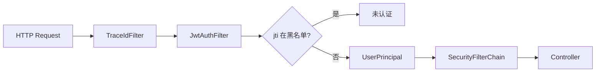

# 流程：Token 与安全

## 1. JWT Access Token

| 项 | 值 |
|----|-----|
| 算法 | HS256（`um.auth.jwt-secret`） |
| 有效期 | 默认 2h（`access-token-ttl`） |
| iss | `um-core` |
| sub | userId |
| jti | 唯一 ID，用于黑名单 |
| device_id | 设备标识 |

**签发**：`JwtTokenService.createAccessToken`  
**校验**：`JwtAuthFilter` → `JwtTokenService.parse`

## 2. Refresh Token

- 格式：UUID 字符串
- 存储：Redis `um:refresh:{userId}:{deviceId}`，TTL 30 天
- **轮换**：refresh 接口成功后旧值删除

## 3. 请求认证链

## 4. 登录风控

| 机制 | 实现 |
|------|------|
| 密码错误锁定 | `LoginLockService`，默认 5 次 / 30 分钟 |
| 异地 IP | `geo-login-alert-enabled=true` 时比较 `ext_data.lastLoginIp` |
| 密码存储 | BCrypt factor 12 |

## 5. 日志安全

**禁止**打印：password、accessToken、refreshToken、短信验证码全文。

## 6. 生产建议

| 项 | 建议 |
|----|------|
| JWT | 改用 RS256 + 密钥轮换 |
| HTTPS | 全链路 TLS |
| API Key | 宿主后端批量调用时使用 `X-Api-Key`（规约预留） |
