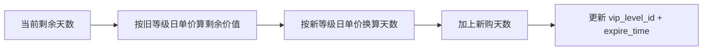
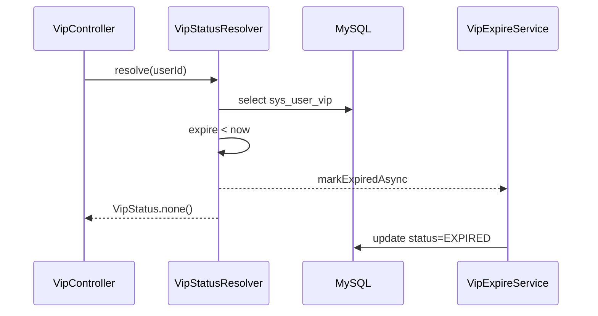

# 流程：VIP 升级与过期

## 1. 升级 Upgrade

### 前置校验

1. 用户必须有 `sys_user_vip` 记录
2. 新等级 `weight` **大于** 旧等级
3. `order_no` 未处理、幂等键有效

### 折算算法

**实现类**：`VipUpgradeCalculator.calculateNewExpire`

```
remainingDays = max(0, daysBetween(now, expire_time))
remainingValue = remainingDays × (oldMonthlyPrice / 30)
convertedDays = remainingValue ÷ (newMonthlyPrice / 30)  // 向下取整
new_expire = now + convertedDays + purchasedDays
```



**实现类**：`VipApplicationService.upgrade`

---

## 2. 惰性过期（核心）

### 读路径（同步）

```
VipStatusResolver.resolve(userId):
  if vip == null → none()
  if expire_time < now:
      if status == ACTIVE → markExpiredAsync(userId)  // 不等待
      return none()   // 对调用方：非 VIP
  if status == EXPIRED → none()
  return active VipStatus
```

### 写路径（异步）

```
VipExpireService.markExpiredAsync(userId)  @Async umTaskExecutor
  → UPDATE sys_user_vip SET status=0 WHERE user_id=?
```

### 触发时机

| 场景 | 是否触发 resolve |
|------|------------------|
| GET /vip/me | 是 |
| 登录成功 | 是 |
| VIP 写操作前 | 间接（resolve 返回后） |

### 明确禁止

```java
// 反模式：定时任务扫表
@Scheduled(cron = "0 0 * * * ?")
void downgradeAllExpired() { ... }
```

---

## 3. 状态对照

| 库内 status | expire_time | 对外 resolve 结果 |
|-------------|-------------|-------------------|
| ACTIVE(1) | 未来 | active VIP |
| ACTIVE(1) | 已过 | none（并异步改 EXPIRED） |
| EXPIRED(0) | 任意 | none |

---

## 4. 时序：查询时发现过期



前端/宿主应以 `active=false` 展示普通用户，无需等待异步完成。
