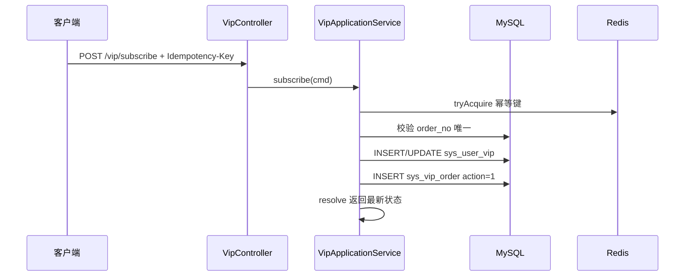

# 流程：VIP 开通与续费

## 1. 查询 VIP 状态（惰性）

任何需要判断「当前是否 VIP」的路径，应调用：

```
VipStatusResolver.resolve(userId)
```

见 [VIP 升级与过期](VIP升级与过期.md)。

---

## 2. 开通 Subscribe



### 到期时间计算

```
expire_time = now + durationDays
status = ACTIVE(1)
```

若无 `sys_user_vip` 行则 INSERT，否则 UPDATE 等级与到期时间。

**实现类**：`VipApplicationService.subscribe`

---

## 3. 续费 Renew

### 到期时间计算

```
base = max(expire_time, now)   // 已过期则从 now 起算
expire_time = base + durationDays
```

### 流水

- `action_type = 2`（RENEW）
- `old_level_id` 为续费前等级

**实现类**：`VipApplicationService.renew`

---

## 4. 幂等与防重

| 机制 | 说明 |
|------|------|
| `Idempotency-Key` Header | Redis `um:idempotency:{key}` 24h |
| `order_no` 唯一索引 | 重复订单抛 `VIP_ORDER_DUPLICATE` |

宿主支付回调应使用支付单号作为 `orderNo`。

---

## 5. 等级字典

| level_code | weight | 月费（种子数据） |
|------------|--------|------------------|
| BRONZE | 10 | 19.90 |
| SILVER | 20 | 39.90 |
| GOLD | 30 | 79.90 |

查询：`VipStatusResolver.requireLevel(levelCode)`
