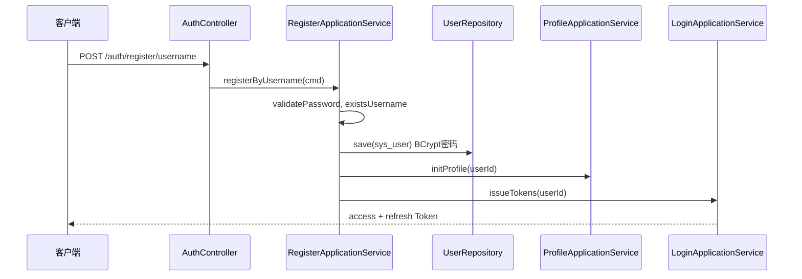
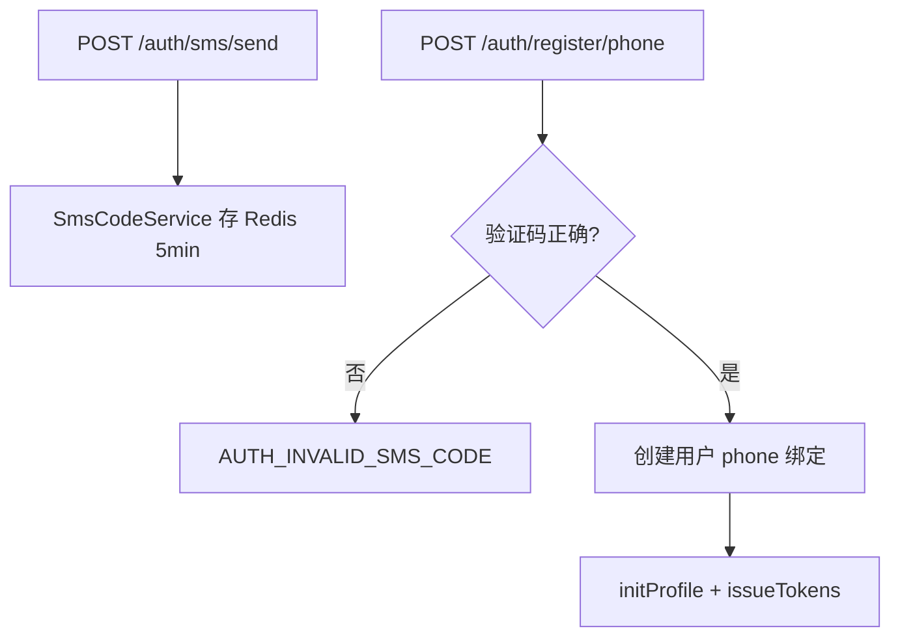
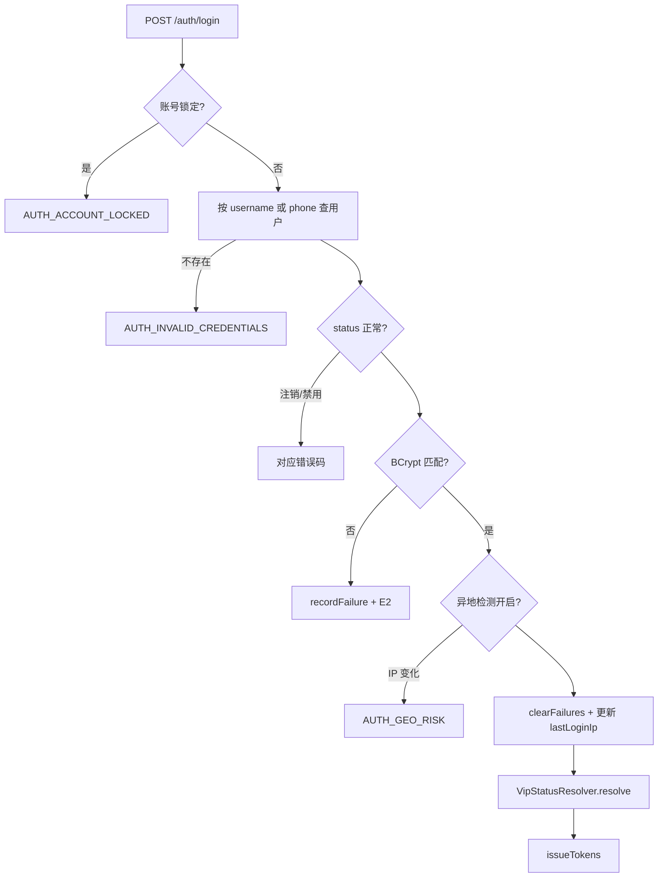

# 流程：注册与登录

## 1. 用户名注册

### 关键步骤

1. 密码长度 ≥ 8
2. 用户名唯一性检查
3. `ext_data` 写入 `registerType=USERNAME`、`registerIp`
4. 同事务：用户 + 资料初始化
5. 注册成功即自动登录

**实现类**：`RegisterApplicationService.registerByUsername`

---

## 2. 手机号注册

**实现类**：

- `SmsCodeApplicationService.sendLoginCode`
- `RegisterApplicationService.registerByPhone`

---

## 3. 登录

### 多端 SSO 说明

- 每个 `deviceId` 独立一条 Refresh：`um:refresh:{userId}:{deviceId}`
- 同用户多设备可同时在线
- 踢人：`POST /auth/kick-all` 删除所有 refresh 键

**实现类**：`LoginApplicationService.login`

---

## 4. 刷新 Token

1. 校验 `um:refresh:{userId}:{deviceId}` 与请求中 refreshToken 一致
2. **轮换**：删除旧 refresh，签发新 access + refresh
3. 旧 access 未强制黑名单（依赖短 TTL）

**实现类**：`LoginApplicationService.refresh`
