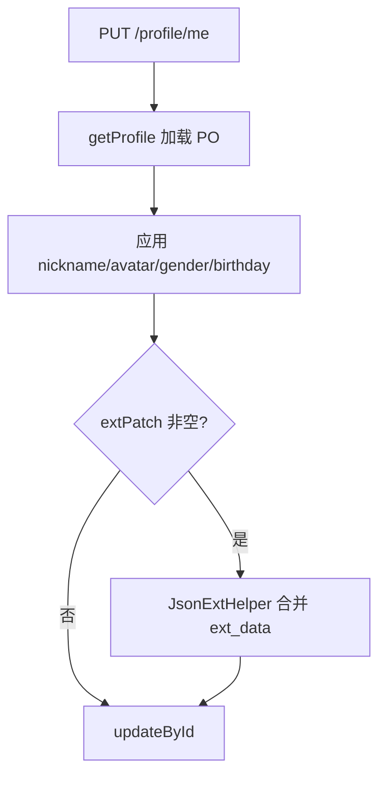

# 流程：用户资料

## 1. 资料初始化（注册时）

触发点：`RegisterApplicationService` 在 `userRepository.save` 之后。

```
ProfileApplicationService.initProfile(userId, nickname)
  → INSERT sys_user_profile
  → nickname 默认：参数或 "用户" + id 后四位
  → gender = 0, ext_data = null
```

## 2. 查询当前资料

```
GET /profile/me
  → UserPrincipal.currentUserId()
  → ProfileApplicationService.getProfile(userId)
  → ProfileResponse.from(PO)
```

不存在时：`PROFILE_NOT_FOUND` (30001)

## 3. 更新资料



### extPatch 合并规则

- 仅更新请求中出现的 key
- key 以 `_` 开头则跳过（系统保留）
- 示例：`{ "signature": "hello", "_internal": "x" }` → 只写入 signature

**实现类**：`ProfileApplicationService.updateProfile`

## 4. 与账号表关系

| 表 | 职责 |
|----|------|
| sys_user | 登录标识、密码、手机、邮箱 |
| sys_user_profile | 展示属性、业务扩展 JSON |

账号注销后资料行保留（逻辑删除策略可按产品决定是否同步 `is_deleted`）。
