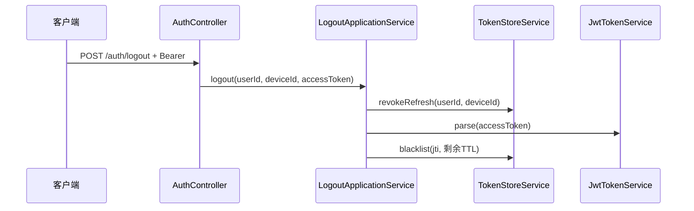
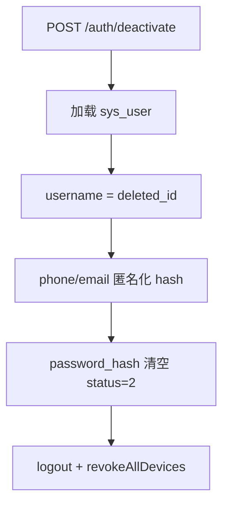

# 流程：登出、踢人、注销

## 1. 退出登录（单设备）



**效果**：

- 当前设备 Refresh 失效
- 当前 Access 在剩余有效期内进入黑名单

**实现类**：`LogoutApplicationService.logout`

---

## 2. 踢掉所有设备

```
POST /auth/kick-all
  → TokenStoreService.revokeAllDevices(userId)
  → 删除 Redis 键 um:refresh:{userId}:*
```

已发出的 Access Token 仍可能有效至过期（除非配合黑名单遍历，当前未实现全量 jti 记录）。

**实现类**：`LogoutApplicationService.kickAllDevices`

---

## 3. 账号注销（Deactivate）



### 设计原则

- **不** `DELETE FROM sys_user`
- 保留 `id` 供宿主关联历史订单
- 禁止再次登录（status=DEACTIVATED）

**实现类**：`DeactivateApplicationService.deactivate`

### 宿主侧建议

- 展示名改为「已注销用户」
- 清理本地 PII 缓存
